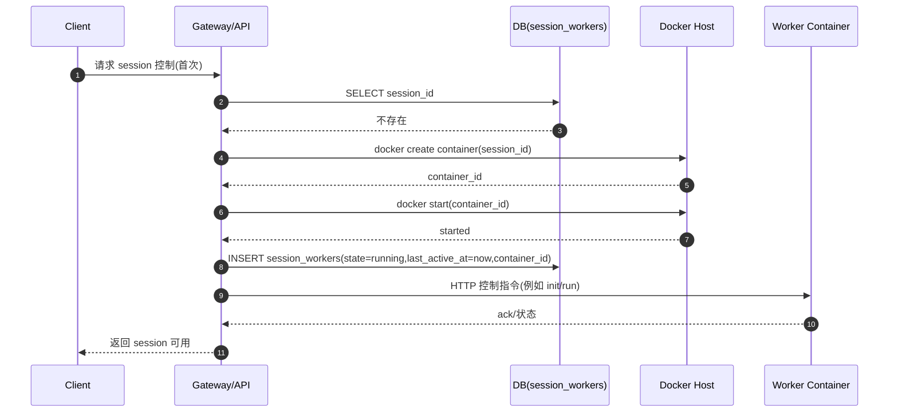
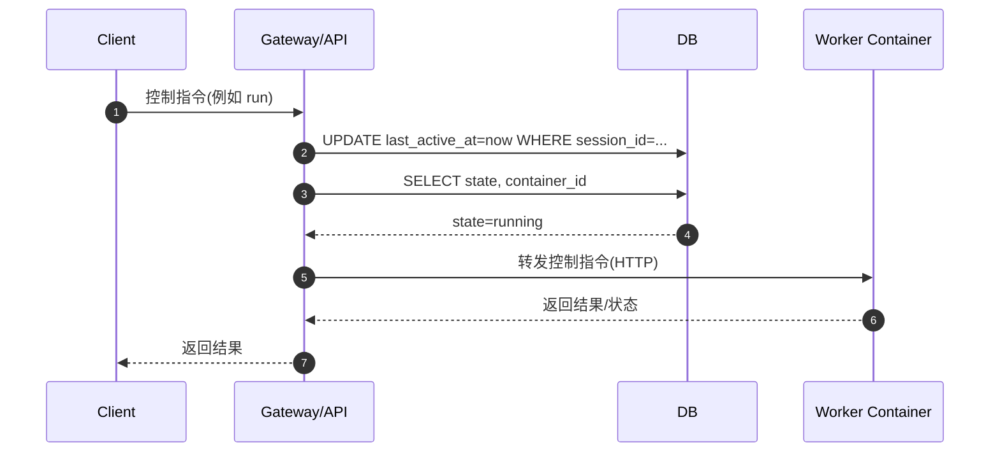
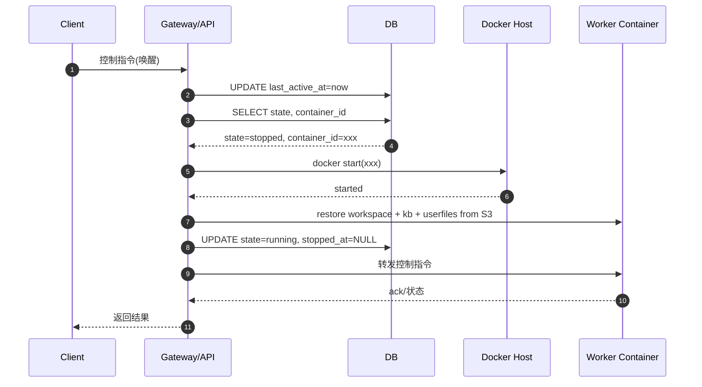
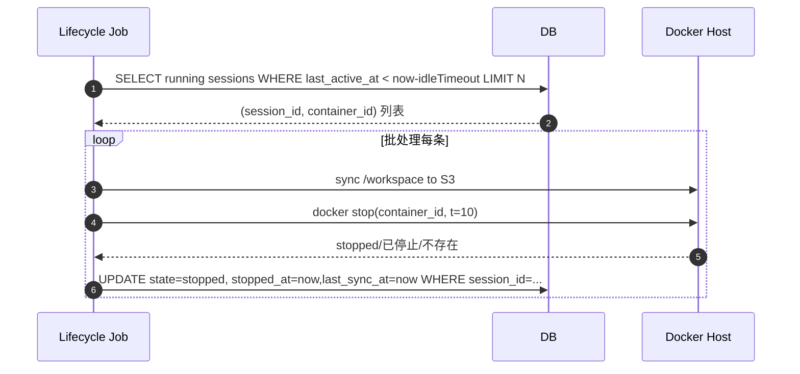
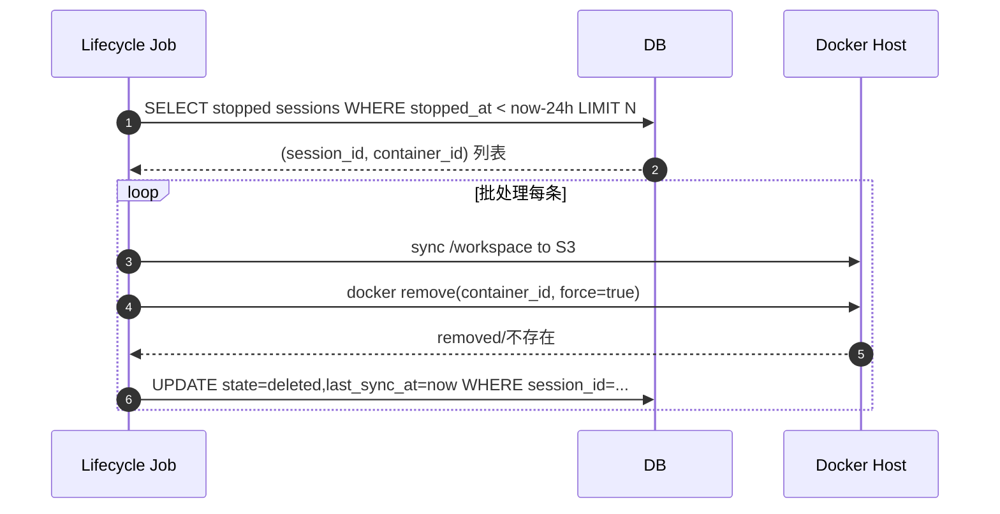
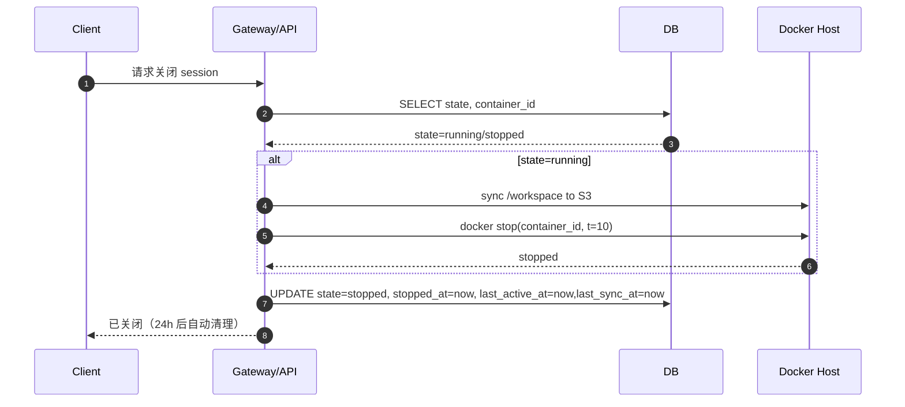
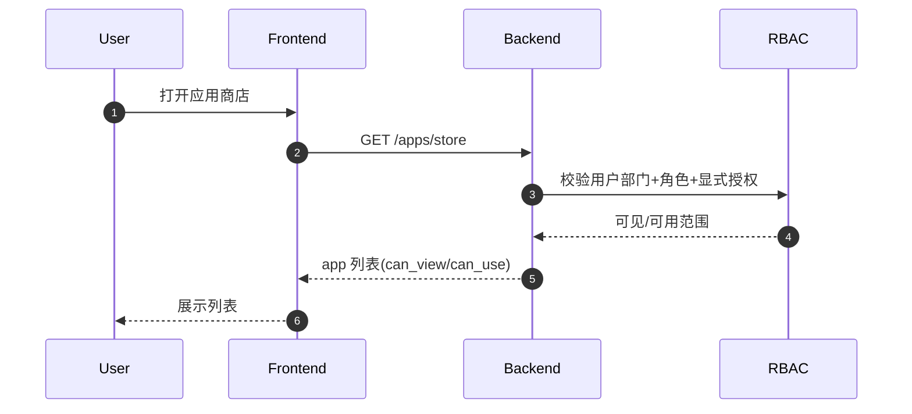
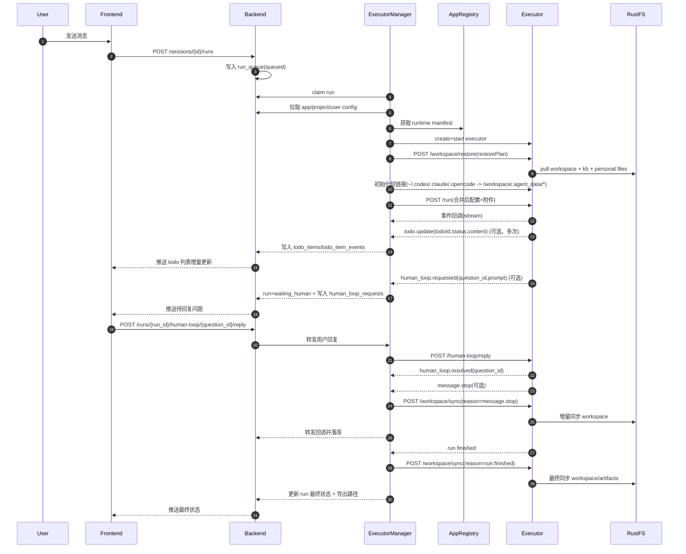
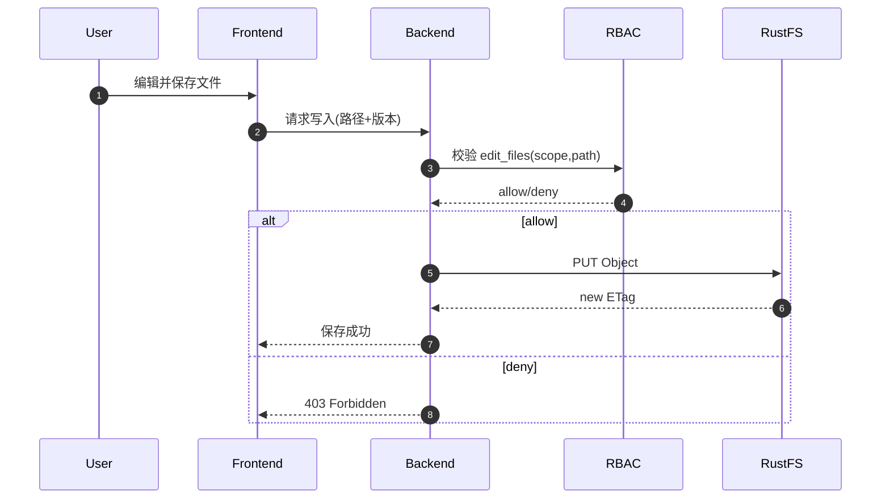
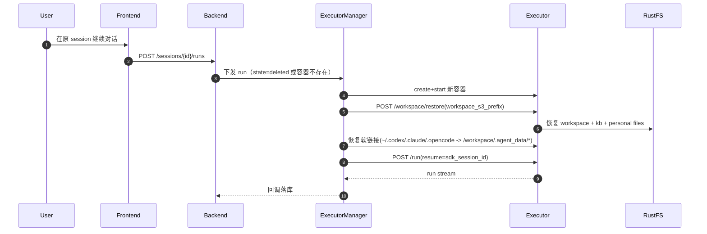

# Agent Worker 系统设计书

## 1. 目标

构建一个支持以下能力的 Agent Worker 系统：

1. 支持 **1 worker（会话容器） = 1 session**
2. 支持 **1 executor（执行容器） = 1 run**（按需创建）
3. Worker/Executor 以 Docker 容器形式运行
4. Executor 内部常驻 HTTP 服务控制 Codex opencode claudecode 等 agent cli 工具
5. 用户无交互后自动 stop 容器
6. stop 超过 24 小时自动 remove
7. 支持并发 ~100
8. 不依赖 RustFS 挂载，使用 S3 同步
9. 系统结构尽量简单，可维护
10. 首批必须完成 3 个 CLI provider 适配：Claude Code CLI、Opencode、Codex CLI
11. 必须支持 Human-in-the-loop 工具（如 `askuser`），用户回复可回传至 agent cli sdk
12. 必须支持 agent cli 的 `todolist`（实时渲染、状态追踪、历史回放）

---

# 2. 总体架构

```
                ┌─────────────┐
                │   用户前端   │
                └──────┬──────┘
                       │
                ┌──────▼──────┐
                │  API/Gateway │
                └──────┬──────┘
                       │
                ┌──────▼──────┐
                │  Postgres   │
                │(SoT + Queue)│
                └──────┬──────┘
                       │
                ┌──────▼──────┐
                │  Lifecycle  │
                │  Worker     │
                └──────┬──────┘
                       │
                ┌──────▼──────┐
                │ Docker Host │
                └──────┬──────┘
                       │
         ┌───────────────────────────────┐
         │  Worker Container (1:1)      │
         │  - HTTP 控制服务             │
         │  - agentcli                     │
         │  - S3 sync                   │
         └───────────────────────────────┘
```

---

说明：

- 不依赖 Redis；`run_queue` 采用 Postgres 表实现（claim + lock + retry）

---

# 3. 核心设计原则

## 3.0 术语约定（对齐）

- `worker`：会话级运行单元（session 维度）
- `executor`：一次 run 的执行容器（run 维度）
- `executor-manager`：负责任务 claim、容器调度、同步编排
- 本文默认“会话生命周期”由 `worker` 视角描述，“单次执行”由 `executor` 视角描述

---

## 3.1 不使用 rustfs 挂载

原因：

- 对象存储不具备完整 POSIX 语义
- 不支持 symlink/hardlink
- FUSE 性能与稳定性不可预测
- 会影响 agentcli/skills

### 替代方案

- Worker 内部使用 `mc mirror`
- 数据流：pull/restore → run → sync/push
- 会话工作目录仅在容器内部（`/workspace`，容器可写层）
- 不使用 host bind mount，不从宿主机挂载任何目录到容器
- 不使用 Docker Volume
- 不使用 tmpfs，容器 stop/start 后数据保留在同一容器可写层
- 容器 stop/remove 前必须先完成 workspace 同步到 S3

---

## 3.2 容器生命周期策略

每个 Session 对应一个 Docker 容器。

状态机：

```
          用户消息
   STOPPED ───────────► RUNNING
       ▲                   │
       │                   │ idle timeout
       │                   ▼
       └─────── STOP ◄──── RUNNING

STOPPED 超过 24h → REMOVE
```

---

# 4. 数据库设计

## 表：session_workers

| 字段           | 类型      | 说明                        |
| -------------- | --------- | --------------------------- |
| session_id     | PK        | 会话 ID                     |
| container_id   | string    | Docker 容器 ID              |
| workspace_s3_prefix | string | S3 工作区前缀（`app/{app_id}/project/{project_name_or_default}/{userloginname}/session/{session_id}/workspace`） |
| state          | enum      | running / stopped / deleted |
| last_active_at | timestamp | 最后交互时间                |
| stopped_at     | timestamp | 停止时间                    |
| last_sync_at   | timestamp | 最近一次同步到 S3 时间      |
| last_sync_status | enum    | idle / running / success / failed |
| last_sync_error | text     | 最近一次同步失败原因         |
| created_at     | timestamp | 创建时间                    |
| updated_at     | timestamp | 更新时间                    |

核心字段：

- last_active_at
- stopped_at
- workspace_s3_prefix
- last_sync_at
- last_sync_status

---

# 5. 生命周期管理

## 5.1 用户有消息时

流程：

1. 查询 session
2. 计算并确认 `workspace_s3_prefix=app/{app_id}/project/{project_name_or_default}/{userloginname}/session/{session_id}/workspace`
3. 如果 state=deleted 或容器不存在 → create + start 新容器
4. 如果 state=stopped → docker start
5. 容器启动后先执行 `restore`：
   - 从 app 注册中心拉取 `runtime manifest`（目录模板、初始化文件、冲突策略、必需文件）
   - 按 manifest 先组织 `/workspace` 基础目录结构
   - 从 S3 拉取 workspace 到 `/workspace`
   - 从 S3 拉取 app/project 知识库与个人文件到容器指定目录
   - 创建软链接：`~/.codex -> /workspace/.agent_data/codex`、`~/.claude -> /workspace/.agent_data/claude`、`~/.opencode -> /workspace/.agent_data/opencode`
   - 执行启动校验（必需文件存在、软链接有效、路径安全）
6. 更新：
   - last_active_at = now
   - state = running

7. 转发控制请求到 worker HTTP（完成 restore 后才可运行 agent sdk）

---

## 5.2 定时清理任务

通过简单 cron 实现，每 10 分钟执行。

### Step 1：Stop idle worker

条件：

```
state = running
AND last_active_at < now - idleTimeout
```

执行：

```
sync workspace -> S3 (required, timeout+retry)
docker stop
update state=stopped
update stopped_at=now
update last_sync_at=now
update last_sync_status=success
```

---

### Step 2：Remove long-stopped worker

条件：

```
state = stopped
AND stopped_at < now - 24h
```

执行：

```
sync workspace -> S3 (required, timeout+retry)
docker rm -f
update state=deleted
update last_sync_at=now
update last_sync_status=success
```

---

# 6. Worker 容器设计

## 6.1 容器职责

- 启动 HTTP 服务（如 Express）
- 接收控制指令
- 管理 Agent cli 子进程
- 进行 S3 pull/push

---

## 6.2 Docker 创建参数（重要）

必须设置：

```ts
HostConfig: {
  NanoCpus: 1e9,              // 1 CPU
  Memory: 2048 * 1024 * 1024, // 2GB
  PidsLimit: 512,
  AutoRemove: false,
  RestartPolicy: { Name: "unless-stopped" }
}
```

说明：

- `/workspace` 使用容器内部可写层
- 不使用 host bind mount
- 不使用 Docker Volume
- 不使用 tmpfs
- 不自动 remove（由系统控制）
- `~/.codex` `~/.claude` `~/.opencode` 必须软链接到 `/workspace/.agent_data/*`
- stop/remove 前必须同步 `/workspace`（含 `.agent_data`）到 S3
- 同步状态为 `failed` 时禁止容器删除，需重试成功后再删除

---

# 7. 并发设计（~100）

并发 100 建议拆分为：

- 会话容器（worker）数量上限：例如 50
- 执行容器（executor）并发：例如 100

或：

- 会话容器 100 个
- 每个会话串行执行 run（每次一个 executor）

关键控制点：

- Docker 宿主机资源必须设置上限
- 清理任务必须批量 + limit

---

# 9. 简化后的系统优势

- 架构简单
- 状态单一来源：数据库
- 无延迟任务复杂去抖
- 无容器事件监听依赖
- 无 rustfs 文件系统坑
- 清理逻辑可重复执行（幂等）

---

# 10. 风险与注意事项

## 10.1 容器状态与 DB 不一致

解决：

- 清理任务执行前先 inspect 容器
- 如果容器不存在 → 标记 deleted

---

## 10.2 Docker 资源耗尽

必须：

- CPU limit
- Memory limit
- PidsLimit
- 并发上限

---

## 10.3 启动风暴

避免：

- 一次性创建大量容器
- 做启动节流

---

## 10.4 残留可写层数据

风险：

- stop/remove 前同步失败会导致工作数据未持久化

解决：

- stop/remove 路径强制执行 `sync workspace -> S3`，失败则不允许进入删除步骤
- 用户点击“停止生成（agent message stop）”时触发一次增量同步
- 增加兜底同步任务：扫描 `running/stopped` 且 `last_sync_at` 过旧的 session，补做增量同步
- 将 `last_sync_status/last_sync_error` 记录到 DB，便于告警与人工干预

---

# 11. 参数建议（初始值）

| 项目              | 建议       |
| ----------------- | ---------- |
| idle stop         | 10~30 分钟 |
| remove after stop | 24 小时    |
| 清理频率          | 每 1 分钟  |
| worker 内存       | 2GB        |
| worker CPU        | 1 core     |

---

# 12. 总结

本设计方案具备：

- 结构清晰
- 容器生命周期可控
- 支持并发 100
- 不依赖 rustfs 挂载
- 易于维护与排查

---

下面补充一份**“时序图版本设计说明”**（用 Mermaid 画，方便你直接放到设计书里）。我按你最终方案：**DB 管状态 + 定时清理任务**、**1 worker(session)=1 session + 1 executor=1 run**、**无消息就 stop**、**stop 24h 后删** 来写。

---

# 时序图版本设计说明

## 0. 参与者说明

- **Client**：用户前端/调用方
- **Gateway/API**：统一入口，负责路由与鉴权
- **DB**：`session_workers` 状态表（单一事实源）
- **Docker Host**：运行容器的宿主机
- **Worker Container**：常驻容器（HTTP 控制服务 + agentcli）
- **Lifecycle Job**：定时清理任务（cron ）

---

## 1) 用户首次进入会话（创建并启动 worker）



**要点**

- 容器创建、启动完成后再写 DB
- `last_active_at` 在首次请求时更新

---

## 2) 用户再次交互（容器已 running）



**要点**

- 每次消息都先刷新 `last_active_at`
- running 状态下不做 docker 操作

---

## 3) 用户交互时发现容器已 stopped（按需启动）



**要点**

- “唤醒”是同步路径：保证用户请求能立即工作
- `stopped_at` 可清空或保留历史（看你要不要审计）
- 唤醒后必须先完成 restore，再运行 agent sdk

---

## 4) 定时清理任务：Stop idle running worker

> 规则：**running 且 last_active_at 超过 idleTimeout（如 10~30 分钟）→ stop**



**要点**

- 批处理（`LIMIT N`）防止一次 stop 太多
- docker stop 失败可以下次重试（幂等）
- stop 前同步失败应重试并告警，不直接跳过
- 可选：先 `inspect` 容器，已不存在则直接标记 deleted

---

## 5) 定时清理任务：Remove stopped 24h worker

> 规则：**stopped 且 stopped_at 超过 24h → remove**



**要点**

- remove 也要批处理
- remove 前必须完成同步
- remove 后工作文件会随容器自动删除
- 容器不存在视为成功（幂等）
- DB 标记 deleted 后可选择物理删除行或留存审计

---

## 6) 用户主动关闭会话（即时 stop + 进入删除倒计时）



**要点**

- 立即 stop 省资源
- 删除仍由定时任务统一执行（避免同步路径 delete 的复杂性）

---

# 竞态与一致性处理（简要说明）

即使采用“DB + 定时任务”，仍建议做两点轻量保护：

1. **同 session 的 start/stop 冲突**
   - Gateway 在“唤醒 start”时先查 DB state
   - 清理任务 stop 前再次确认 `last_active_at` 是否仍超时（可选）
   - 允许偶发“stop 后立刻又 start”，下一次周期纠正即可（系统最终一致）

2. **容器丢失/手动删除**
   - 清理任务执行 docker 操作时若返回 “not found”，直接将 DB 标记 `deleted`

---

# 13. 平台模块总览（继续设计）

在现有会话执行链路基础上，平台补齐以下域：

- 用户与组织：用户、部门、角色、权限策略
- 应用商店：应用列表、可见性与可用性控制
- 应用注册：app / project / user 三层知识库与 agentconfig
- 文件存储：统一走 RustFS S3 API（不做 FUSE 挂载）
- 全局文件浏览器：按权限浏览与编辑
- 执行链路：Backend（事实源）+ executor-manager（调度）+ executor（单次执行）

---

# 14. 用户、部门、角色与权限模型

## 14.1 角色定义

- 平台管理员（platform_admin）：
  - 全局管理用户、部门、角色、应用、策略
- app 管理员（app_admin）：
  - 使用 app
  - 管理 app 级知识库与 app 级 agentconfig
- project 管理员（project_admin）：
  - 使用 app（在授权 project 范围内）
  - 管理 project 级知识库与 project 级 agentconfig
- 普通用户（member）：
  - 使用 app
  - 管理个人知识库与个人 agentconfig

## 14.2 权限作用域

权限判断必须包含 `action + scope` 两部分：

- action：`use_app` / `manage_kb` / `manage_agentconfig` / `browse_files` / `edit_files`
- scope：
  - 平台级：`platform`
  - 应用级：`app:{app_id}`
  - 项目级：`project:{project_id}`
  - 用户级：`user:{user_id}`
  - 部门级可见性：`department:{department_id}`

## 14.3 最小权限规则

- `platform_admin` 默认拥有所有 action + scope
- `app_admin` 只对被授予的 `app:{app_id}` 生效
- `project_admin` 只对被授予的 `project:{project_id}` 生效
- `member` 默认只有 `use_app` + `user:{self}`
- 文件浏览权限复用同一 RBAC，不单独维护第二套模型

---

# 15. 应用商店与应用注册设计

## 15.1 应用商店（可见与可用）

商店列表返回两类结果：

- 可见（can_view）：用户能看到该 app 卡片
- 可用（can_use）：用户可发起会话执行

推荐规则：

- 部门白名单 + 角色白名单 + 显式用户授权（任一满足即可可见）
- 可用需额外满足：未禁用 + 用户有 `use_app` 权限

## 15.2 应用注册三层模型

每个 app 维护三层配置：

1. app 层（全局默认）：
   - `app_kb_set`
   - `app_agentconfig`
2. project 层（可多个）：
   - `project_kb_set`
   - `project_agentconfig`
3. user 层（可多个）：
   - `user_kb_set`
   - `user_agentconfig`

运行时合并顺序（后者覆盖前者）：

`app_agentconfig <- project_agentconfig <- user_agentconfig <- run_overrides`

知识库集合建议做并集并打标签：

`effective_kb = app_kb ∪ project_kb ∪ user_kb`

## 15.3 App 注册中心 Runtime Manifest（新增）

每个 app 发布可执行版本时，注册中心生成 `runtime manifest`，用于 executor 启动组织 workspace。

建议字段：

- `app_id`
- `runtime_version`
- `workspace_template_prefix`（S3 前缀）
- `required_paths[]`（必须存在的文件/目录）
- `seed_files[]`（首启初始化文件）
- `mount_points[]`（如 `.kb/app`、`.kb/project`、`.user-files`）
- `conflict_policy`（`keep_session` / `prefer_registry` / `merge`）
- `protected_paths[]`（禁止覆盖路径）
- `cleanup_rules[]`（启动前清理规则）

原则：

- executor 启动必须绑定一个明确的 `runtime_version`
- manifest 变更后不影响历史 run，可按 `runtime_version` 回放
- manager 按 manifest 下发恢复计划（restore plan），executor 严格执行

---

# 16. 文件存储（RustFS S3 API）设计

## 16.1 存储原则

- 不使用 rustfs FUSE 挂载
- 不从 host 挂载目录到 executor
- 执行期 workspace 在容器内部可写层
- 需要持久化的文件由 manager 通过 RustFS S3 API 拉取/回传
- 同步必须覆盖 `.agent_data`，且排除 workspace 根下误写的 `.codex/.claude/.opencode`

## 16.2 建议对象键规划

- 应用注册文件：`app/{app_id}/registry/...`
- 应用知识库：`app/{app_id}/kb/...`
- 项目知识库：`app/{app_id}/project/{project_name_or_default}/kb/...`
- 用户知识库与个人文件：`app/{app_id}/project/{project_name_or_default}/{userloginname}/files/...`
- 用户 auth 文件：`app/{app_id}/project/{project_name_or_default}/{userloginname}/auth/...`（建议加密）
- session workspace（固定）：
  - `app/{app_id}/project/{project_name_or_default}/{userloginname}/session/{session_id}/workspace/...`
  - `app/{app_id}/project/{project_name_or_default}/{userloginname}/session/{session_id}/workspace/.agent_data/...`

## 16.3 session-workspace 组织与恢复（完善）

- run 开始前（容器启动后）：
  - 先从 app 注册中心拉取 `runtime manifest`
  - 按 manifest 创建/修复 `/workspace` 目录模板
  - 再从 S3 恢复 session workspace 到 `/workspace`
  - 再同步 app/project 知识库与个人文件到约定目录
  - 再创建 CLI 数据目录软链接到 `/workspace/.agent_data`
  - 最后执行 `required_paths` 校验
- run 运行中：
  - 发生 `agent message stop` 时触发一次增量同步
- run 结束/容器 stop/remove 前：
  - 必须执行一次最终同步（含 `.agent_data`）
- 清理容器后，本地可写层文件消失；以 S3 中 workspace 为恢复来源

### 启动组织顺序（层级）

- L0（Registry Base）：从 `workspace_template_prefix` 组装基础工程骨架
- L1（Session Overlay）：恢复 `session/{session_id}/workspace` 历史快照
- L2（Knowledge Overlay）：挂入 app/project 知识库到 `.kb/*`
- L3（User Overlay）：挂入个人文件到 `.user-files`
- L4（Runtime Fixups）：修复软链接、权限、必需目录

冲突策略默认值：

- 默认 `keep_session`：若 L1 与 L0 冲突，以 session 历史内容为准
- `protected_paths` 永不被 overlay 覆盖
- `seed_files` 仅在目标不存在时写入（幂等）

## 16.4 同步过滤规则（强约束）

- 必须包含：
  - `/workspace/**`
  - `/workspace/.agent_data/**`
- 必须排除：
  - `/workspace/.codex/**`
  - `/workspace/.claude/**`
  - `/workspace/.opencode/**`
- 说明：
  - 三个目录若存在，仅作为误写兜底目录，不参与持久化
  - 正常持久化路径应全部在 `.agent_data` 下

## 16.5 CLI 数据目录映射

- 容器内统一约束：
  - `~/.codex -> /workspace/.agent_data/codex`
  - `~/.claude -> /workspace/.agent_data/claude`
  - `~/.opencode -> /workspace/.agent_data/opencode`
- 若目标目录不存在，启动时自动创建
- 若原路径已存在普通目录，启动流程需迁移后替换为软链接

---

# 17. 全局文件浏览器设计

## 17.1 能力

- 浏览、上传、下载、重命名、删除、在线编辑预览
- 作用域覆盖：app、project、user、session 导出目录

## 17.2 权限控制

- 浏览器所有操作都先走 Backend 鉴权
- 鉴权通过后由 Backend：
  - 方案 A：签发短时 S3 预签名 URL
  - 方案 B：Backend 代理 RustFS API（便于审计与细粒度拦截）

最小操作权限建议：

- `browse_files`：列目录/下载/预览
- `edit_files`：上传/覆盖/删除/重命名

## 17.3 审计

每次文件写操作记录：

- 操作人、对象路径、旧版本 ETag、新版本 ETag、时间、来源 IP

---

# 18. Backend（事实源）扩展设计

## 18.1 核心实体（你已定义）

- `agent_sessions`
- `agent_runs`
- `agent_messages`
- `tool_executions`
- `usage_logs`

## 18.2 新增业务实体（建议）

- `users` / `departments` / `roles` / `user_role_bindings`
- `apps` / `app_visibility_rules` / `app_members`
- `projects` / `project_members` / `app_project_bindings`
- `knowledge_bases` / `kb_bindings`
- `agent_configs`（scope: app/project/user）
- `run_queue`（待执行任务）
- `file_acl_policies` / `file_audit_logs`
- `human_loop_requests` / `human_loop_responses`（askuser 问答链路）
- `todo_items` / `todo_item_events`（todolist 任务与变更历史）

## 18.3 Backend 对外接口（最小集）

- 会话域：创建会话、发消息、查询会话/消息/运行历史
- 会话执行入口协议与流式返回，直接对齐 `参考/route.ts`
- 工具链：查询 tool_executions 链路
- 商店域：应用列表、可见性、授权
- 配置域：app/project/user 的 KB 与 agentconfig 管理
- 文件域：目录树、预签名链接、文件审计查询
- 人机协同域：查询待回复问题、提交用户回复、查看回复历史
- Todo 域：查询当前 run/session 的任务列表与变更轨迹

---

# 19. executor-manager 设计细化

## 19.1 职责

- 从 `run_queue` claim 任务并加锁
- 创建 executor 容器（按 run 级或 session 级复用策略）
- 下发技能、附件、命令、运行参数
- 从 app 注册中心读取 `runtime manifest` 并生成 restore plan
- 在 run 前执行 restore（workspace + app/project kb + personal files）
- 接收 executor 回调并转发 Backend
- 处理 Human-in-the-loop：仅当 provider 发出可恢复的人机协同事件时，将 run 置为 `waiting_human`
- 接收 UI 用户回复并路由回 executor 再继续 run；不支持注入回复的 provider 走降级策略
- 处理 `todo.update`：标准化后写入 `todo_items/todo_item_events`
- 在 `message.stop` / run 结束 / stop / remove 前执行同步并更新 `last_sync_at`

## 19.2 关键状态机（run）

`queued -> claimed -> restoring -> linking -> preparing -> running -> [waiting_human -> running]? -> syncing -> exported -> succeeded|failed|canceled`

要求：

- 同一 `run_id` 幂等处理（重复回调不重复落库）
- manager 崩溃恢复后可从 `claimed/running` 状态续处理
- `syncing` 未成功前禁止执行容器 remove
- `waiting_human` 必须持久化 `question_id`，重复问题不重复入库

---

# 20. executor 设计细化

## 20.0 首批 Provider 适配范围（优先级）

首批上线前必须完成以下 3 个 provider（P0）：

1. Claude Code CLI provider  
   [ai-sdk-provider-claude-code](https://github.com/ben-vargas/ai-sdk-provider-claude-code)
2. Opencode provider  
   [ai-sdk-provider-opencode-sdk](https://github.com/ben-vargas/ai-sdk-provider-opencode-sdk)
3. Codex CLI provider  
   [ai-sdk-provider-codex-cli](https://github.com/ben-vargas/ai-sdk-provider-codex-cli)

要求：

- 三个 provider 统一走同一 executor 抽象层（不允许在业务层分叉逻辑）
- P0 统一能力只要求：`run`、`stream`、`stop`、错误码映射
- `resume`、`human-loop`、`todo` 采用“能力标记 + 降级策略”，不强制三家完全等价
- 统一事件模型：`message/tool/todo/workspace/run` 回调结构一致
- 单 provider 故障不影响其他 provider 的调度与执行

## 20.0.1 文档核验后的能力矩阵（2026-02-11）

| 能力 | Opencode provider | Claude Code provider | Codex CLI provider |
| --- | --- | --- | --- |
| `run/stream/stop` | 支持 | 支持 | 支持 |
| 会话续跑（resume） | 支持（`continueSession/sessionID`） | 文档未暴露显式参数（按“不保证”处理） | 支持（`conversationId/forkConversation`） |
| build/plan 模式切换 | 支持（`agent: build/plan/general/explore`） | 不支持 build；仅 `permissionMode` 含 `plan` | 不提供 build/plan；使用 `approvalMode/sandboxMode/profile` |
| 自定义 AI SDK tools | 不支持（仅内置工具） | 不支持（仅内置工具） | 不支持（仅内置工具） |
| 中途注入用户回复（通用 `askuser/reply`） | 未形成通用协议，按“可选增强”处理 | 未形成通用协议，按“可选增强”处理 | CLI provider 不支持；若强依赖该能力需切换 Codex App Server provider |

设计结论（约束）：

- “统一 `agent=build/plan`”仅适用于 Opencode；平台层必须改为“统一 `executionProfile` + provider 映射”。
- Human-in-the-loop 不能作为三 provider 的硬性 P0 约束，应改为 capability-gated。
- 如必须支持“运行中注入用户输入并继续执行”，应将 Codex 路径切到 App Server provider（其文档明确支持 mid-execution input injection）。

## 20.1 执行模型

- 单次任务容器，内建 Node.js HTTP 服务
- 使用 ai-sdk-provider 驱动多种 Agent CLI
- 会话续跑按 provider 能力启用（不在平台层强制统一参数名）

## 20.1.1 各 provider 启动参数与模型参数（落地清单）

- Opencode provider：
  - Provider 初始化参数：`hostname`、`port`、`autoStartServer`、`serverTimeout`、`defaultSettings`
  - 常用模型参数：`agent`、`continueSession`、`sessionID`、`permissionMode`、`workingDirectory`、`maxSteps`、`tools`
- Claude Code provider：
  - 常用模型参数：`permissionMode`、`allowedTools/disallowedTools`、`maxTurns`、`cwd`、`mcpServers`、`verbose`、`continue`
  - `permissionMode` 枚举与 Opencode 的 `agent` 语义不同，不能混用
- Codex CLI provider：
  - 常用模型参数：`approvalMode`、`sandboxMode`、`config`、`mcpServers`、`profile`、`cwd`、`webSearch`、`includePartialToolCalls`、`useThinking`
  - 通过 `conversationId/forkConversation` 控制会话延续与分叉

## 20.1.2 本节核验来源（官方/一手）

- AI SDK `useChat`（状态机、transport、stop/regenerate 等）：<https://ai-sdk.dev/docs/reference/ai-sdk-ui/use-chat>
- AI SDK `UIMessage`（Part 类型与 `tool-{toolName}` 结构）：<https://ai-sdk.dev/docs/reference/ai-sdk-core/ui-message>
- AI SDK UI Stream Protocol（chunk 格式）：<https://ai-sdk.dev/docs/ai-sdk-ui/stream-protocol>
- Opencode provider：<https://ai-sdk.dev/providers/community-providers/opencode-sdk>
- Claude Code provider：<https://ai-sdk.dev/providers/community-providers/claude-code>
- Codex CLI provider：<https://ai-sdk.dev/providers/community-providers/codex-cli>
- Codex App Server provider（中途注入输入能力）：<https://ai-sdk.dev/providers/community-providers/codex>

## 20.2 回调事件（建议标准化）

传输层以 AI SDK UI Stream Protocol 为准（chunk 级）：

- `start` / `start-step` / `finish-step` / `finish` / `error`
- `text-start` / `text-delta` / `text-end`
- `reasoning-start` / `reasoning-delta` / `reasoning-end`
- `source-url` / `source-document` / `file`
- `tool-input-start` / `tool-input-delta` / `tool-input-available` / `tool-output-available`
- `data-*`（自定义结构化数据）

平台内部可再映射为领域事件（便于落库/前端订阅）：

- `message.delta` / `message.done`
- `tool.start` / `tool.end`
- `todo.update` / `todo.snapshot`
- `human_loop.requested` / `human_loop.resolved`（仅 capability 支持时产生）
- `run.status` / `run.error`

所有事件带 `trace_id, session_id, run_id, executor_id, ts`

## 20.2.1 内置 Tool Message 格式对齐（按 provider）

| Provider | 工具控制参数 | UIMessage/流式表现 | 设计约束 |
| --- | --- | --- | --- |
| Opencode | `tools: Record<string, boolean>`（可显式禁用如 `question: false`） | 统一映射到 `tool-input-*` / `tool-output-available`，前端渲染为 `tool-{toolName}` | 不依赖 provider 私有字段；只消费标准 stream chunk |
| Claude Code | `allowedTools` / `disallowedTools` / `canUseTool` | 同上，工具输入输出走标准 ToolUIPart | 工具审批逻辑在平台层统一封装，不把 provider 原始结构直接透出 |
| Codex CLI | `approvalMode`、`sandboxMode`、`includePartialToolCalls` | 同上，工具事件经标准协议落库与渲染 | 对“计划工具”按可选能力处理，不强依赖单一 provider 私有开关 |

## 20.3 executor 暴露接口（最小）

- `POST /run`
- `POST /cancel`
- `GET /status`
- `GET /workspace/tree`
- `GET /workspace/file`
- `PUT /workspace/file`
- `GET /workspace/download`
- `GET /ttyd`（鉴权后透传）
- `POST /human-loop/reply`（capability-gated：仅支持 human-loop 的 provider 启用）
- `GET /human-loop/pending`（capability-gated：返回当前 run 待回复问题）
- `GET /runs/{run_id}/todos`（返回当前 run 的 todo 列表）
- `GET /runs/{run_id}/todos/events`（返回 todo 变更流/历史）

## 20.4 接口层实现基线（直接参考 `参考/route.ts`）

建议把“聊天执行入口”做成与 `参考/route.ts` 一致的形态，便于前端和 SDK 复用：

- 路由：`POST /api/chat-opencode`（或网关同等路由）
- 输入体（兼容 demo）：
  - `messages: UIMessage[]`
  - `chatId?: string`
  - `id?: string`（兼容字段）
  - `provider?: "opencode" | "claude-code" | "codex-cli"`（默认 `opencode`）
  - `executionProfile?: string`（统一字段，服务端按 provider 映射）
  - `providerOptions?: Record<string, unknown>`（透传 provider 特有参数）
  - `agent?: "build" | "plan"`（仅保留给 opencode 的兼容字段）
- 核心流程：
  - `req.json()` 解析请求
  - `convertToModelMessages(messages)` 做模型消息转换
  - `streamText(...)` 发起流式执行
  - `onStepFinish` 记录 step 级日志（后续映射到 `tool_executions`）
  - `toUIMessageStreamResponse(...)` 返回流式 UI 响应（若前端要展示 reasoning/source，显式开启 `sendReasoning/sendSources`）
- 完成回调：
  - demo 中 `saveChat` 写本地文件
  - 平台版本改为写 Backend：`agent_messages / agent_runs / usage_logs`
- 错误处理：
  - 与 demo 一致返回 `500 + JSON { error }`
  - 增加 `trace_id` 方便排障与回放

对齐要点（与 `参考/route.ts` 的关键行）：

- Provider 初始化：`createOpencode(...)`
- 流式执行入口：`streamText(...)`
- UI 流返回：`toUIMessageStreamResponse(...)`
- 结束时持久化：`onFinish(...)`

## 20.5 Provider 统一抽象（TypeScript）

```ts
type ProviderKind = "claude-code" | "opencode" | "codex-cli";

interface ProviderRunInput {
  readonly provider: ProviderKind;
  readonly model: string;
  readonly messages: readonly UIMessage[];
  readonly resumeSessionId?: string;
  readonly executionProfile?: string;
  readonly tools?: Record<string, unknown>;
  readonly providerOptions?: Record<string, unknown>;
}

interface ProviderRunHandle {
  stream(): AsyncIterable<unknown>;
  stop(): Promise<void>;
}

interface TodoItem {
  readonly todoId: string;
  readonly content: string;
  readonly status: "todo" | "doing" | "done" | "canceled";
  readonly order: number;
  readonly updatedAt: string;
}

interface AgentProviderAdapter {
  readonly kind: ProviderKind;
  readonly capabilities: {
    readonly resume: boolean;
    readonly humanLoop: boolean;
    readonly todoStream: boolean;
    readonly buildPlanMode: boolean;
  };
  run(input: ProviderRunInput): Promise<ProviderRunHandle>;
  reply?(input: {
    readonly sdkSessionId: string;
    readonly questionId: string;
    readonly answer: string;
  }): Promise<void>;
}
```

落地建议：

- `executor` 内通过 `ProviderKind -> Adapter` 注册表选择实现
- `route.ts` 入口只负责协议与流式返回，不包含 provider 业务分支
- provider 特有参数通过 `providerOptions` 扩展，避免污染通用字段
- `askuser` 仅在 provider 有能力时映射为 `human_loop.requested/resolved`；无能力时走降级策略（终止并提示用户补充输入后重试）
- `todolist` 统一映射为 `todo.update/todo.snapshot`，统一 `todoId/content/status/order`

---

# 21. 关键时序（平台补充）

## 21.1 商店列表查询



## 21.2 发起一次 run



补充说明：

- `human_loop.requested/reply` 仅在 provider 能力支持时进入该分支。
- 对不支持中途注入回复的 provider，manager 应返回“需补充输入后重试”的可操作提示。

## 21.3 全局文件浏览器写文件



## 21.4 容器删除后恢复对话



---

# 22. 里程碑建议

1. M1（最小可用）：
   - 会话执行链路打通（Backend + manager + executor）
   - app 层配置 + 用户基础权限
   - 完成 Claude Code CLI / Opencode / Codex CLI 三 provider 适配与联调
2. M2（可运营）：
   - 应用商店可见/可用策略
   - project/user 层 KB 与 agentconfig
   - 全局文件浏览器只读 + 下载
3. M3（企业能力）：
   - 文件浏览器可编辑 + 审计
   - ttyd + workspace 导出历史
   - 细粒度用量与成本统计

---

# 23. Frontend 架构建议（React）

UI 交互与组件组织直接参考 `参考/page.tsx`，在此基础上替换为平台后端数据源。

## 23.1 页面骨架（对齐 `参考/page.tsx`）

- 顶部 Header：
  - 左侧：移动端历史按钮 + 品牌标识
  - 中间：执行配置切换（`executionProfile`，由 provider 决定可选项）
  - 右侧：预留操作区
- 主体两栏：
  - 左栏（桌面端）：历史会话列表 + 新对话
  - 右栏：`ChatThread`（消息流、输入框、状态）
- 移动端：
  - 历史会话抽屉（`isHistoryOpen`）覆盖层

## 23.2 ChatThread 交互（对齐实现）

- 使用 `useChat` + `DefaultChatTransport`
  - `api: /api/chat-opencode`
  - `body: { provider, executionProfile }`（兼容 opencode 的 `agent`）
- 状态机对齐：`ready` / `submitted` / `streaming` / `error`
- 输入行为：
  - Enter 发送、Shift+Enter 换行
  - streaming 时发送按钮切换为 stop 按钮（调用 `stop()`）
  - 错误时显示重试按钮（调用 `regenerate()`）
  - `useChat` 不管理输入框状态，输入值由组件本地状态维护
  - 当模型请求工具确认时，通过 `addToolResult/addToolApprovalResponse` 回传审批结果
- 体验细节：
  - 自动滚动到底部
  - textarea 高度自适应
  - 空会话展示欢迎区 + 快捷提示卡片

## 23.3 消息渲染矩阵（对齐 Part 类型）

- `text`：Markdown 渲染
- `reasoning`：可折叠思考面板，streaming 时默认展开
- `step-start`：步骤分隔线与步骤号
- `source-url` / `source-document`：来源卡片
- `file`：图片预览或附件卡片
- `data-*`：结构化数据块（JSON 预览）
- `tool-{toolName}`：按 AI SDK 标准 ToolUIPart 渲染；`input-*` 与 `output-*` 状态分别展示

## 23.4 历史会话交互（对齐 API）

- `GET /api/chat-opencode-history`：加载历史列表
- `POST /api/chat-opencode-history`：新建会话
- `GET /api/chat-opencode-history/{chatId}`：加载会话消息
- 前端状态：
  - `historyStatus: idle | loading | error`
  - `activeChatId`
  - `initialMessages`
- 初始化策略：
  - 优先加载最近会话
  - 无历史则自动创建首个会话

## 23.5 平台化替换点

- `chatId` 在平台侧映射到 `session_id`（可保留前端字段名兼容）
- `onFinish/saveChat` 替换为平台持久化查询接口（由 Backend 事实源提供）
- 工具调用、usage、workspace 变化由 `agent_runs + tool_executions + usage_logs` 回填前端
- ttyd 与文件树作为右侧可折叠面板追加，不改变主聊天流结构

## 23.6 样式基线

- 继续采用 `page.tsx` 的暗色系与 Markdown 全局样式规则
- 保留桌面侧栏 + 移动端抽屉的响应式结构（`md` 断点）
- `ToolInvocationView` 样式保持轻量可折叠，避免淹没主对话内容

## 23.7 App 工作台增强（本次补充）

- 右侧 Tab 面板（与聊天并排）：
  - `Agent`：启动状态与运行指标
  - `Todo`：agent 任务列表
  - `Files`：文件管理
  - `Preview`：文件预览
  - `TTYD`：终端
  - `Ask User`：待回复问题列表与输入

- Agent 启动状态（必备）：
  - 状态枚举：`restoring -> linking -> preparing -> running -> syncing -> stopped -> error`
  - 展示字段：`executor_id`、`run_id`、当前阶段、阶段耗时、最近错误
  - 数据来源：`GET /runs/{run_id}` + 实时事件流（SSE/WebSocket）

- Ask User（必备）：
  - 在聊天流内展示 `askuser` 卡片（问题、上下文、截止时间）
  - 支持快捷回复、长文本回复、历史回复查看
  - 提交接口：`POST /runs/{run_id}/human-loop/{question_id}/reply`
  - 回复成功后 UI 将该卡片标记为 `resolved` 并继续监听 run 流
  - 若当前 provider 不支持 human-loop 注入能力，则隐藏回复输入，改为展示“重试并附带补充信息”引导

- TodoList（必备）：
  - 在右侧 `Todo` 面板显示 `todo/doing/done/canceled` 分组
  - 在聊天流中对 `todo.update` 显示轻量时间线（可折叠）
  - 对接接口：`GET /runs/{run_id}/todos` + 实时事件流
  - 支持按 `order` 排序；无序时按首次出现顺序稳定排序
  - 支持 run 结束后历史回放（只读）

- 文件管理（必备）：
  - 树形目录、上传、下载、重命名、删除、新建文件
  - 默认根：`/workspace`
  - 操作前校验权限：`browse_files` / `edit_files`
  - 对接接口：`GET /workspace/tree`、`GET /workspace/file`、`PUT /workspace/file`、`GET /workspace/download`

- 文件预览（必备）：
  - 文本：代码高亮 + 只读/编辑切换
  - 图片/PDF：内嵌预览
  - 二进制：仅展示元信息 + 下载
  - 大文件限制与分页读取（防止阻塞主线程）

- TTYD（必备）：
  - 通过 `GET /ttyd` 获取受控入口
  - 与当前 `run_id/executor_id` 绑定
  - 非 running 状态显示只读提示或禁用

- 交互优先级：
  - 聊天流始终主区域优先
  - Agent/Files/Preview/TTYD 为辅助面板，不中断消息流渲染

## 23.8 Provider 交互模式映射（新增）

- Opencode：
  - UI 暴露 `agent` 选项：`build | plan | general | explore`
  - 平台 `executionProfile` 到 `agent` 一一映射
- Claude Code：
  - UI 暴露 `permissionMode`：`default | acceptEdits | plan | bypassPermissions`
  - 不提供 build 模式按钮，避免误导
- Codex CLI：
  - UI 暴露安全/执行配置：`approvalMode` + `sandboxMode` + `profile`
  - 不提供 build/plan 切换，必要时用系统提示词实现“先规划后执行”

---

# 24. Backend 回调与一致性约束

## 24.1 回调落库原则

- manager 收到 executor 回调后先写入 `agent_messages/tool_executions`，再更新 `agent_runs`
- 任意回调失败可重试，要求 `event_id` 幂等去重
- 收到 `message.stop` 回调时立即触发增量同步，并记录一次 `last_sync_at`
- 收到 `human_loop.requested` 时（仅 provider 支持）写入 `human_loop_requests(question_id,run_id,status=pending)`
- 用户回复必须按 `question_id` 幂等写入 `human_loop_responses`（不支持 human-loop 的 provider 不触发此分支）
- 收到 `todo.update` 时按 `todo_id + run_id` upsert `todo_items`，并写 `todo_item_events`

## 24.3 Human-in-the-loop 超时与取消

- `waiting_human` 超时策略可配置：例如 15 分钟/60 分钟
- 超时后可选策略：
  - 标记 run failed（默认）
  - 使用默认回复继续（需 app 配置显式开启）
- 用户取消 run 时，所有 pending 的 `human_loop_requests` 标记为 `canceled`

## 24.4 Todo 一致性规则

- `todo.snapshot` 到达时：
  - 覆盖当前内存态，但保留已落库 `todo_item_events` 历史
- `todo.update` 到达时：
  - 仅更新目标 `todo_id`，不可重置其他项状态
- 幂等键建议：
  - `run_id + todo_id + event_ts + status`
- 回放时以 `todo_item_events` 重建时间线，以 `todo_items` 作为最新态

## 24.2 对账与修复

- 定时任务扫描 `running` 超时 run，触发补偿：
  - 优先向 manager 查询 executor 状态
  - 无法恢复则标记 run failed，并写入系统错误消息
- `usage_logs` 最终由 run 完成事件统一结算，避免中途重复计费

---

# 25. 同步与恢复伪代码（可落地）

## 25.1 统一路径计算

```ts
function workspaceS3Prefix(input: {
  appId: string;
  projectName?: string;
  userLoginName: string;
  sessionId: string;
}) {
  const project = input.projectName?.trim() || "default";
  return `app/${input.appId}/project/${project}/${input.userLoginName}/session/${input.sessionId}/workspace`;
}
```

## 25.2 容器启动后恢复

```ts
async function restoreBeforeRun(ctx: Ctx) {
  const prefix = workspaceS3Prefix(ctx);
  const manifest = await appRegistry.getRuntimeManifest({
    appId: ctx.appId,
    runtimeVersion: ctx.runtimeVersion,
  });

  // 0) build restore plan from registry + s3
  const restorePlan = buildRestorePlan({
    manifest,
    workspacePrefix: `${prefix}/`,
    kbPrefixes: [
      `app/${ctx.appId}/kb/`,
      `app/${ctx.appId}/project/${ctx.project}/kb/`,
    ],
    userFilesPrefix: `app/${ctx.appId}/project/${ctx.project}/${ctx.userLoginName}/files/`,
  });

  // 1) apply L0 registry base + L1/L2/L3 overlays
  await executor.post("/workspace/restore", {
    plan: restorePlan,
    conflictPolicy: manifest.conflict_policy ?? "keep_session",
    protectedPaths: manifest.protected_paths ?? [],
  });

  // 2) ensure cli links
  await executor.post("/workspace/link-agent-data");

  // 3) startup validation
  await executor.post("/workspace/validate", {
    requiredPaths: manifest.required_paths ?? [],
  });
}
```

## 25.3 软链接修复逻辑

```ts
async function linkAgentData(home: string = "/root") {
  const pairs = [
    { link: `${home}/.codex`, target: "/workspace/.agent_data/codex" },
    { link: `${home}/.claude`, target: "/workspace/.agent_data/claude" },
    { link: `${home}/.opencode`, target: "/workspace/.agent_data/opencode" },
  ];

  for (const p of pairs) {
    await mkdirp(p.target);
    await migrateIfRealDir(p.link, `${p.target}.migrated`);
    await forceSymlink(p.target, p.link);
  }
}
```

## 25.4 同步逻辑（含过滤）

```ts
const SYNC_INCLUDE = ["/workspace/**", "/workspace/.agent_data/**"];
const SYNC_EXCLUDE = ["/workspace/.codex/**", "/workspace/.claude/**", "/workspace/.opencode/**"];

async function syncWorkspace(ctx: Ctx, reason: "message.stop" | "run.finished" | "pre.stop" | "pre.remove") {
  await db.updateSessionWorker(ctx.sessionId, {
    last_sync_status: "running",
    last_sync_error: null,
  });

  try {
    const prefix = workspaceS3Prefix(ctx);
    await executor.post("/workspace/sync", {
      to: `${prefix}/`,
      include: SYNC_INCLUDE,
      exclude: SYNC_EXCLUDE,
      reason,
    });

    await db.updateSessionWorker(ctx.sessionId, {
      last_sync_status: "success",
      last_sync_at: now(),
      last_sync_error: null,
    });
  } catch (err) {
    await db.updateSessionWorker(ctx.sessionId, {
      last_sync_status: "failed",
      last_sync_error: String(err),
    });
    throw err;
  }
}
```

## 25.5 Stop/Remove 门闩

```ts
async function stopWorker(ctx: Ctx) {
  await syncWorkspace(ctx, "pre.stop"); // 必须成功
  await docker.stop(ctx.containerId);
  await db.markStopped(ctx.sessionId);
}

async function removeWorker(ctx: Ctx) {
  await syncWorkspace(ctx, "pre.remove"); // 必须成功
  await docker.remove(ctx.containerId, { force: true });
  await db.markDeleted(ctx.sessionId);
}
```

---

# 26. Runtime Manifest 类型与示例

## 26.1 TypeScript 严格类型（建议）

```ts
type ConflictPolicy = "keep_session" | "prefer_registry" | "merge";
type RestoreLayer = "registry_base" | "session_overlay" | "knowledge_overlay" | "user_overlay";
type CleanupAction = "remove_if_exists" | "truncate_if_exists";

interface RuntimeManifestSeedFile {
  readonly from: string; // s3 prefix or key
  readonly to: string;   // absolute path in container workspace
  readonly ifMissingOnly: boolean;
}

interface RuntimeManifestMountPoint {
  readonly name: "app_kb" | "project_kb" | "user_files" | "agent_data";
  readonly targetPath: string; // e.g. /workspace/.kb/app
  readonly readOnly: boolean;
}

interface RuntimeManifestCleanupRule {
  readonly action: CleanupAction;
  readonly path: string; // absolute path in container workspace
}

interface RuntimeManifest {
  readonly appId: string;
  readonly runtimeVersion: string;
  readonly workspaceTemplatePrefix: string;
  readonly requiredPaths: readonly string[];
  readonly seedFiles: readonly RuntimeManifestSeedFile[];
  readonly mountPoints: readonly RuntimeManifestMountPoint[];
  readonly conflictPolicy: ConflictPolicy;
  readonly protectedPaths: readonly string[];
  readonly cleanupRules: readonly RuntimeManifestCleanupRule[];
}

interface RestorePlanEntry {
  readonly layer: RestoreLayer;
  readonly fromPrefix: string;
  readonly toPath: string;
  readonly optional: boolean;
}

interface RestorePlan {
  readonly appId: string;
  readonly runtimeVersion: string;
  readonly workspaceS3Prefix: string;
  readonly conflictPolicy: ConflictPolicy;
  readonly protectedPaths: readonly string[];
  readonly entries: readonly RestorePlanEntry[];
}

interface RunContext {
  readonly appId: string;
  readonly projectName: string; // "default" when empty
  readonly userLoginName: string;
  readonly sessionId: string;
  readonly runtimeVersion: string;
}
```

## 26.2 Runtime Manifest JSON 示例（可直接落库）

```json
{
  "appId": "code-assistant",
  "runtimeVersion": "2026.02.11",
  "workspaceTemplatePrefix": "app/code-assistant/registry/runtime/2026.02.11/template/",
  "requiredPaths": [
    "/workspace/.agent_data",
    "/workspace/.kb/app",
    "/workspace/.kb/project",
    "/workspace/.user-files"
  ],
  "seedFiles": [
    {
      "from": "app/code-assistant/registry/runtime/2026.02.11/seeds/README.md",
      "to": "/workspace/README.md",
      "ifMissingOnly": true
    },
    {
      "from": "app/code-assistant/registry/runtime/2026.02.11/seeds/.editorconfig",
      "to": "/workspace/.editorconfig",
      "ifMissingOnly": true
    }
  ],
  "mountPoints": [
    {
      "name": "app_kb",
      "targetPath": "/workspace/.kb/app",
      "readOnly": true
    },
    {
      "name": "project_kb",
      "targetPath": "/workspace/.kb/project",
      "readOnly": true
    },
    {
      "name": "user_files",
      "targetPath": "/workspace/.user-files",
      "readOnly": false
    },
    {
      "name": "agent_data",
      "targetPath": "/workspace/.agent_data",
      "readOnly": false
    }
  ],
  "conflictPolicy": "keep_session",
  "protectedPaths": [
    "/workspace/.agent_data",
    "/workspace/.codex",
    "/workspace/.claude",
    "/workspace/.opencode"
  ],
  "cleanupRules": [
    {
      "action": "remove_if_exists",
      "path": "/workspace/.tmp"
    },
    {
      "action": "truncate_if_exists",
      "path": "/workspace/.runtime/logs/bootstrap.log"
    }
  ]
}
```

## 26.3 Restore Plan JSON 示例（manager 下发 executor）

```json
{
  "appId": "code-assistant",
  "runtimeVersion": "2026.02.11",
  "workspaceS3Prefix": "app/code-assistant/project/default/alice/session/sess_01/workspace",
  "conflictPolicy": "keep_session",
  "protectedPaths": [
    "/workspace/.agent_data",
    "/workspace/.codex",
    "/workspace/.claude",
    "/workspace/.opencode"
  ],
  "entries": [
    {
      "layer": "registry_base",
      "fromPrefix": "app/code-assistant/registry/runtime/2026.02.11/template/",
      "toPath": "/workspace",
      "optional": false
    },
    {
      "layer": "session_overlay",
      "fromPrefix": "app/code-assistant/project/default/alice/session/sess_01/workspace/",
      "toPath": "/workspace",
      "optional": true
    },
    {
      "layer": "knowledge_overlay",
      "fromPrefix": "app/code-assistant/kb/",
      "toPath": "/workspace/.kb/app",
      "optional": true
    },
    {
      "layer": "knowledge_overlay",
      "fromPrefix": "app/code-assistant/project/default/kb/",
      "toPath": "/workspace/.kb/project",
      "optional": true
    },
    {
      "layer": "user_overlay",
      "fromPrefix": "app/code-assistant/project/default/alice/files/",
      "toPath": "/workspace/.user-files",
      "optional": true
    }
  ]
}
```
